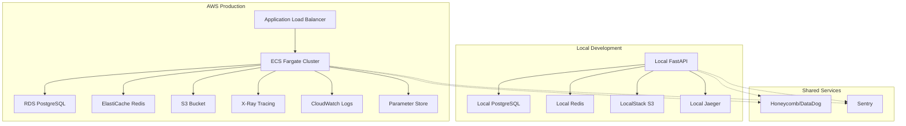

# Prethrift Architecture & AWS Deployment Strategy

## 🏗️ Architecture Analysis: Lambda vs Fargate

### **Recommendation: AWS Fargate (ECS) + Local Development Hybrid**

Based on your requirements for AI-powered search with embeddings, real-time processing, and comprehensive observability, **AWS Fargate with ECS** is the optimal choice.

## 📊 Architecture Comparison

| Factor | AWS Lambda | AWS Fargate (ECS) | **Winner** |
|--------|------------|-------------------|------------|
| **Cold Start** | 1-10 seconds | ~30 seconds (one-time) | Lambda |
| **Execution Time** | 15 min max | Unlimited | **Fargate** |
| **Memory** | 10GB max | Up to 30GB | **Fargate** |
| **AI Model Loading** | Poor (cold starts) | Excellent (persistent) | **Fargate** |
| **WebSocket Support** | Limited | Full support | **Fargate** |
| **Observability** | Basic | Full control | **Fargate** |
| **Cost (Low Traffic)** | Lower | Higher | Lambda |
| **Cost (High Traffic)** | Higher | Lower | **Fargate** |
| **Development Experience** | Complex locally | Excellent | **Fargate** |

## 🎯 Why Fargate is Better for Prethrift

### ✅ **AI/ML Workloads**
- **Model Persistence**: CLIP models stay loaded in memory
- **No Cold Starts**: Instant response for search queries
- **GPU Support**: Option for GPU-accelerated inference
- **Large Memory**: Handle large embedding matrices efficiently

### ✅ **Real-time Features**
- **WebSocket Support**: Real-time search suggestions
- **Streaming Responses**: Progressive search results
- **Long-running Processes**: Background embedding generation

### ✅ **Development Experience**
- **Docker Consistency**: Same container locally and in production
- **Full Observability**: Complete tracing and monitoring
- **Easy Debugging**: Standard application patterns

## 🏠 Local Development + AWS Hybrid Architecture



## 🛠️ Implementation Strategy

### 1. **Containerized Development**

Create a development-optimized Docker setup:

```dockerfile
# Dockerfile.dev
FROM python:3.11-slim

WORKDIR /app
COPY requirements.txt .
RUN pip install -r requirements.txt

# Development-specific dependencies
RUN pip install watchdog[watchmedo]

COPY . .
CMD ["watchmedo", "auto-restart", "--directory=.", "--pattern=*.py", "--recursive", "--", "uvicorn", "app.main:app", "--host", "0.0.0.0", "--port", "8000"]
```

### 2. **Docker Compose for Local Services**

```yaml
# docker-compose.dev.yml
version: '3.8'
services:
  app:
    build:
      context: .
      dockerfile: Dockerfile.dev
    ports:
      - "8001:8000"
    environment:
      - ENVIRONMENT=development
      - DATABASE_URL=postgresql://postgres:postgres@db:5432/prethrift
      - REDIS_URL=redis://redis:6379
      - AWS_ENDPOINT_URL=http://localstack:4566
    volumes:
      - .:/app
      - /app/__pycache__
    depends_on:
      - db
      - redis
      - localstack
      - jaeger

  db:
    image: pgvector/pgvector:pg15
    environment:
      POSTGRES_DB: prethrift
      POSTGRES_USER: postgres
      POSTGRES_PASSWORD: postgres
    ports:
      - "5432:5432"
    volumes:
      - postgres_data:/var/lib/postgresql/data

  redis:
    image: redis:7-alpine
    ports:
      - "6379:6379"
    volumes:
      - redis_data:/data

  localstack:
    image: localstack/localstack:latest
    ports:
      - "4566:4566"
    environment:
      - SERVICES=s3,ssm,secretsmanager
      - DEBUG=1
    volumes:
      - localstack_data:/var/lib/localstack

  jaeger:
    image: jaegertracing/all-in-one:latest
    ports:
      - "16686:16686"
      - "14268:14268"
    environment:
      - COLLECTOR_OTLP_ENABLED=true

volumes:
  postgres_data:
  redis_data:
  localstack_data:
```

### 3. **Environment-based Configuration**

```python
# app/config.py (enhanced)
from enum import Enum
from typing import Optional
from pydantic_settings import BaseSettings

class Environment(str, Enum):
    DEVELOPMENT = "development"
    STAGING = "staging"
    PRODUCTION = "production"

class Settings(BaseSettings):
    # Environment detection
    environment: Environment = Environment.DEVELOPMENT

    # Database
    database_url: Optional[str] = None
    db_host: str = "localhost"
    db_port: int = 5432
    db_name: str = "prethrift"
    db_user: str = "postgres"
    db_password: str = "postgres"

    # Redis caching
    redis_url: Optional[str] = None
    redis_host: str = "localhost"
    redis_port: int = 6379
    cache_ttl: int = 3600

    # AWS Configuration
    aws_region: str = "us-east-1"
    aws_endpoint_url: Optional[str] = None  # For LocalStack
    images_bucket: str = "prethrift-images"

    # Observability
    otlp_endpoint: Optional[str] = None
    jaeger_endpoint: Optional[str] = "http://localhost:14268"
    sentry_dsn: Optional[str] = None
    log_level: str = "INFO"

    @property
    def is_local(self) -> bool:
        return self.environment == Environment.DEVELOPMENT

    @property
    def database_url_computed(self) -> str:
        if self.database_url:
            return self.database_url
        return f"postgresql://{self.db_user}:{self.db_password}@{self.db_host}:{self.db_port}/{self.db_name}"

    @property
    def redis_url_computed(self) -> str:
        if self.redis_url:
            return self.redis_url
        return f"redis://{self.redis_host}:{self.redis_port}"

    class Config:
        env_file = ".env"
```

## 🔧 Service Integration Patterns

### 1. **Caching Strategy (Redis)**

```python
# app/services/cache.py
import redis.asyncio as redis
from typing import Optional, Any
import json
import pickle
from app.config import settings

class CacheService:
    def __init__(self):
        self.redis = redis.from_url(
            settings.redis_url_computed,
            encoding="utf-8",
            decode_responses=False
        )

    async def get_embedding(self, key: str) -> Optional[list]:
        """Get cached embedding vector."""
        try:
            data = await self.redis.get(f"embedding:{key}")
            if data:
                return pickle.loads(data)
        except Exception as e:
            logger.warning(f"Cache get failed: {e}")
        return None

    async def set_embedding(self, key: str, embedding: list, ttl: int = None):
        """Cache embedding vector."""
        try:
            ttl = ttl or settings.cache_ttl
            await self.redis.setex(
                f"embedding:{key}",
                ttl,
                pickle.dumps(embedding)
            )
        except Exception as e:
            logger.warning(f"Cache set failed: {e}")

    async def get_search_results(self, query_hash: str) -> Optional[dict]:
        """Get cached search results."""
        try:
            data = await self.redis.get(f"search:{query_hash}")
            if data:
                return json.loads(data)
        except Exception as e:
            logger.warning(f"Search cache get failed: {e}")
        return None

# Usage in search endpoints
async def cached_search(query: str, cache: CacheService):
    query_hash = hashlib.md5(query.encode()).hexdigest()

    # Try cache first
    results = await cache.get_search_results(query_hash)
    if results:
        return results

    # Perform search
    results = await perform_search(query)

    # Cache results
    await cache.set_search_results(query_hash, results, ttl=300)
    return results
```

### 2. **AWS Services Integration**

```python
# app/services/aws.py
import boto3
from botocore.config import Config
from app.config import settings

class AWSService:
    def __init__(self):
        # Support both local and AWS environments
        self.config = Config(
            region_name=settings.aws_region,
            retries={'max_attempts': 3}
        )

        # Use LocalStack for local development
        self.endpoint_url = settings.aws_endpoint_url if settings.is_local else None

        self.s3 = boto3.client(
            's3',
            config=self.config,
            endpoint_url=self.endpoint_url
        )

        self.ssm = boto3.client(
            'ssm',
            config=self.config,
            endpoint_url=self.endpoint_url
        )

    async def upload_image(self, key: str, file_data: bytes) -> str:
        """Upload image to S3 (or LocalStack locally)."""
        try:
            self.s3.put_object(
                Bucket=settings.images_bucket,
                Key=key,
                Body=file_data,
                ContentType='image/jpeg'
            )

            if settings.is_local:
                return f"http://localhost:4566/{settings.images_bucket}/{key}"
            else:
                return f"https://{settings.images_bucket}.s3.{settings.aws_region}.amazonaws.com/{key}"

        except Exception as e:
            logger.error(f"Image upload failed: {e}")
            raise

    async def get_secret(self, secret_name: str) -> str:
        """Get secret from Parameter Store."""
        try:
            response = self.ssm.get_parameter(
                Name=secret_name,
                WithDecryption=True
            )
            return response['Parameter']['Value']
        except Exception as e:
            logger.error(f"Secret retrieval failed: {e}")
            # Fallback to environment variable locally
            return os.getenv(secret_name.upper().replace('/', '_'))
```

### 3. **Observability Integration**

```python
# app/observability/telemetry.py
from opentelemetry import trace, metrics
from opentelemetry.exporter.otlp.proto.http.trace_exporter import OTLPSpanExporter
from opentelemetry.exporter.jaeger.thrift import JaegerExporter
from opentelemetry.sdk.trace import TracerProvider
from opentelemetry.sdk.trace.export import BatchSpanProcessor
import structlog

def setup_telemetry():
    """Setup telemetry based on environment."""

    # Tracing setup
    trace.set_tracer_provider(TracerProvider())
    tracer_provider = trace.get_tracer_provider()

    if settings.is_local:
        # Use Jaeger locally
        if settings.jaeger_endpoint:
            jaeger_exporter = JaegerExporter(
                agent_host_name="localhost",
                agent_port=14268,
            )
            tracer_provider.add_span_processor(
                BatchSpanProcessor(jaeger_exporter)
            )
    else:
        # Use OTLP in production (Honeycomb, DataDog, etc.)
        if settings.otlp_endpoint:
            otlp_exporter = OTLPSpanExporter(
                endpoint=settings.otlp_endpoint,
                headers={"x-honeycomb-team": settings.honeycomb_api_key}
            )
            tracer_provider.add_span_processor(
                BatchSpanProcessor(otlp_exporter)
            )

    # Structured logging
    configure_structured_logging()

def get_tracer(name: str):
    """Get tracer for instrumentation."""
    return trace.get_tracer(name)
```

## 🚀 AWS Production Architecture

### **ECS Fargate Cluster Setup**

```yaml
# infrastructure/ecs-cluster.yml (CloudFormation)
Resources:
  ECSCluster:
    Type: AWS::ECS::Cluster
    Properties:
      ClusterName: prethrift-cluster
      CapacityProviders:
        - FARGATE
        - FARGATE_SPOT

  TaskDefinition:
    Type: AWS::ECS::TaskDefinition
    Properties:
      Family: prethrift-api
      RequiresCompatibilities:
        - FARGATE
      NetworkMode: awsvpc
      Cpu: 1024
      Memory: 2048
      ExecutionRoleArn: !Ref TaskExecutionRole
      TaskRoleArn: !Ref TaskRole
      ContainerDefinitions:
        - Name: prethrift-api
          Image: !Sub ${AWS::AccountId}.dkr.ecr.${AWS::Region}.amazonaws.com/prethrift:latest
          PortMappings:
            - ContainerPort: 8000
          Environment:
            - Name: ENVIRONMENT
              Value: production
            - Name: AWS_REGION
              Value: !Ref AWS::Region
          Secrets:
            - Name: DATABASE_URL
              ValueFrom: !Ref DatabaseUrlParameter
            - Name: REDIS_URL
              ValueFrom: !Ref RedisUrlParameter
          LogConfiguration:
            LogDriver: awslogs
            Options:
              awslogs-group: !Ref LogGroup
              awslogs-region: !Ref AWS::Region
              awslogs-stream-prefix: ecs
```

### **Infrastructure Components**

```yaml
# Complete AWS stack
Resources:
  # RDS PostgreSQL with pgvector
  DBInstance:
    Type: AWS::RDS::DBInstance
    Properties:
      DBInstanceIdentifier: prethrift-db
      DBInstanceClass: db.t3.medium
      Engine: postgres
      EngineVersion: '15.3'
      AllocatedStorage: 100
      StorageType: gp3

  # ElastiCache Redis
  RedisCluster:
    Type: AWS::ElastiCache::ReplicationGroup
    Properties:
      ReplicationGroupId: prethrift-redis
      CacheNodeType: cache.t3.medium
      Engine: redis
      NumCacheClusters: 2

  # Application Load Balancer
  LoadBalancer:
    Type: AWS::ElasticLoadBalancingV2::LoadBalancer
    Properties:
      Name: prethrift-alb
      Type: application
      Scheme: internet-facing

  # S3 for images
  ImagesBucket:
    Type: AWS::S3::Bucket
    Properties:
      BucketName: !Sub prethrift-images-${AWS::AccountId}
```

## 🔄 Deployment Pipeline

### **GitHub Actions Workflow**

```yaml
# .github/workflows/deploy.yml
name: Deploy to AWS

on:
  push:
    branches: [main]

jobs:
  deploy:
    runs-on: ubuntu-latest
    steps:
      - uses: actions/checkout@v3

      - name: Configure AWS credentials
        uses: aws-actions/configure-aws-credentials@v2
        with:
          aws-access-key-id: ${{ secrets.AWS_ACCESS_KEY_ID }}
          aws-secret-access-key: ${{ secrets.AWS_SECRET_ACCESS_KEY }}
          aws-region: us-east-1

      - name: Build and push Docker image
        run: |
          aws ecr get-login-password | docker login --username AWS --password-stdin $ECR_REGISTRY
          docker build -t prethrift .
          docker tag prethrift:latest $ECR_REGISTRY/prethrift:latest
          docker push $ECR_REGISTRY/prethrift:latest

      - name: Deploy to ECS
        run: |
          aws ecs update-service --cluster prethrift-cluster --service prethrift-api --force-new-deployment
```

## 💰 Cost Optimization

### **Development Costs (Monthly)**
- LocalStack: **Free**
- Local containers: **$0**
- Shared services (Sentry/Honeycomb): **$0-50**

### **Production Costs (Monthly)**
- **Fargate**: $50-200 (2 vCPU, 4GB RAM)
- **RDS**: $40-80 (db.t3.medium)
- **ElastiCache**: $30-60 (cache.t3.medium)
- **ALB**: $20
- **S3**: $5-20
- **CloudWatch**: $10-30
- **Total**: **$155-410/month**

### **Scaling Strategy**
- Start with **t3.medium** instances
- Use **FARGATE_SPOT** for 70% cost reduction
- Auto-scaling based on CPU/memory
- Redis cluster for high availability

## 🎯 Development Workflow

### **1. Local Development**
```bash
# Start all services
docker-compose -f docker-compose.dev.yml up

# Develop with hot reload
# Visit http://localhost:8001
```

### **2. Testing**
```bash
# Run tests against local services
pytest tests/ --env=local

# Integration tests with AWS services
pytest tests/ --env=aws-local
```

### **3. Deployment**
```bash
# Deploy to staging
git push origin staging

# Deploy to production
git push origin main
```

## 📋 Migration Steps

1. **Week 1**: Containerize existing FastAPI app
2. **Week 2**: Set up local Docker Compose environment
3. **Week 3**: Implement caching and AWS service integration
4. **Week 4**: Deploy ECS infrastructure with CloudFormation
5. **Week 5**: Set up CI/CD pipeline and monitoring
6. **Week 6**: Performance testing and optimization

This architecture provides the best of both worlds: **excellent local development experience** with **production-ready AWS deployment** that can scale to handle millions of search requests efficiently.
